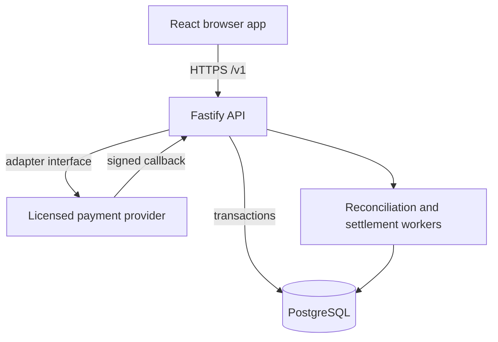

# GiantPay backend architecture

## Runtime boundary

The React application is an API consumer. It never decides whether a payment succeeded, stores provider secrets, computes settlement truth, or writes financial records directly. The Fastify API authenticates users, authorizes every merchant-scoped request and owns payment state. PostgreSQL is the system of record.

The current adapter is a local sandbox simulator. Configuration prevents it from being enabled when `NODE_ENV=production`.

## Security invariants

- Passwords use Argon2id plus an application pepper.
- Browser sessions use random opaque tokens; only token hashes are stored.
- Authorization uses explicit permissions and merchant scoping in every query.
- Mutating financial operations require idempotency keys.
- The browser learns outcomes only through `GET /v1/payment-status/{reference}`.
- Refund requests require approval by a different user before future provider execution.
- Amounts are integer minor units; floating-point currency arithmetic is forbidden.
- Provider callbacks, reconciliation, ledger posting and settlements remain disabled until their production implementations and controls exist.

## Team integration rule

Truman can continue working in `src/` while George works in `server/`. Merge the API contract first, use short-lived branches and rebase before opening a pull request. Do not edit the same generated lockfile from both branches. The shared contract is `server/openapi/giantpay-v1.yaml`; any request or response change must update that file in the same commit.

## Current state and next boundary

This is a working backend foundation, not a licensed production payment gateway. The next implementation boundary is a provider interface backed by documented, approved integrations from commercial banks, mobile-money operators or an authorized switch. Regulatory reporting interfaces must be confirmed with the Reserve Bank of Malawi; they must not be inferred from public web pages.
