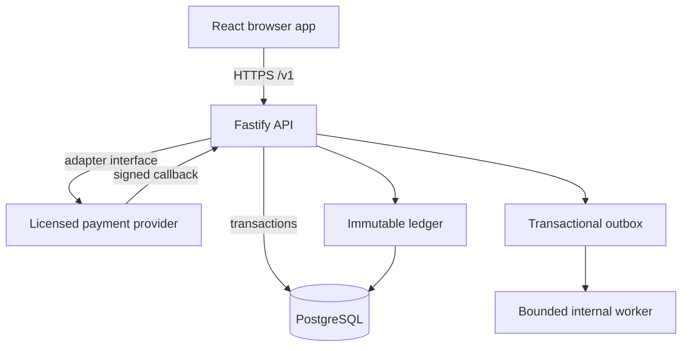
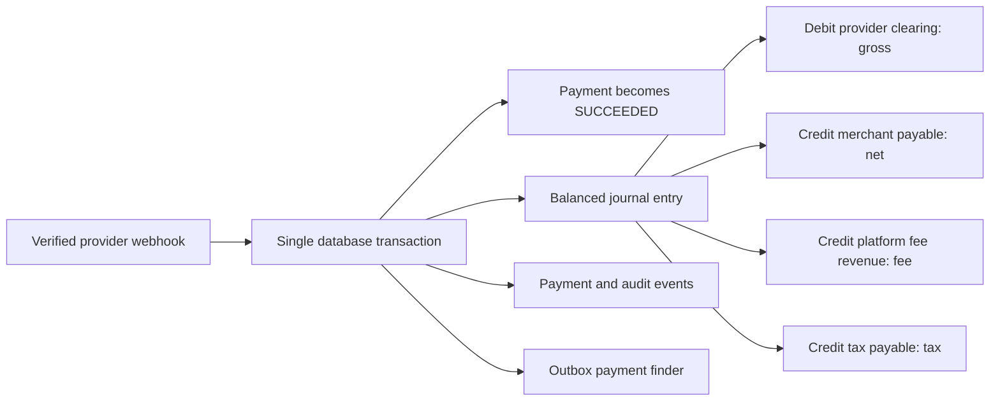

# GiantPay backend architecture

## Runtime boundary

The React application is an API consumer. It never decides whether a payment succeeded, stores provider secrets, computes settlement truth, or writes financial records directly. The Fastify API authenticates users, authorizes every merchant-scoped request and owns payment state. PostgreSQL is the system of record.

The current adapter is a local sandbox simulator. Configuration prevents it from being enabled when `NODE_ENV=production`.

Provider-specific formats are isolated in `src/providers/`. Checkout uses the
provider-neutral `PaymentProvider` interface and persists a payment attempt.
Provider callbacks enter through a raw-body HMAC verification boundary, then
the transactional webhook processor applies the explicit payment state
machine. The trusted status endpoint is read-only and never promotes state on
a timer.

Webhook receipts provide replay protection. A unique `(provider,
provider_event_id)` key and row locks ensure concurrent duplicate delivery does
not repeat payment events or audit records. Reusing an event ID with another
payload hash is recorded as suspicious and rejected.

## Security invariants

- Passwords use Argon2id plus an application pepper.
- Browser sessions use random opaque tokens; only token hashes are stored.
- Authorization uses explicit permissions and merchant scoping in every query.
- Mutating financial operations require idempotency keys.
- The browser learns outcomes only through `GET /v1/payment-status/{reference}`.
- Refund requests require approval by a different user before future provider execution.
- Amounts are integer minor units; floating-point currency arithmetic is forbidden.
- Provider callbacks post the sandbox ledger only after signature and transition verification.
- Reconciliation and settlements remain disabled until their production implementations and controls exist.

## Accounting boundary

Payment processing records provider state. Accounting records financial
effects. Reconciliation compares internal and provider records. Settlement
moves obligations through an approved execution process. None of these steps
is treated as equivalent to another.

Journal entries and postings cannot be updated or deleted. Corrections create
linked opposite entries. A deferred PostgreSQL constraint trigger validates at
commit that each entry contains at least two positive postings and balances
debits and credits independently for every currency.

## Team integration rule

Truman can continue working in `src/` while George works in `server/`. Merge the API contract first, use short-lived branches and rebase before opening a pull request. Do not edit the same generated lockfile from both branches. The shared contract is `server/openapi/giantpay-v1.yaml`; any request or response change must update that file in the same commit.

## Current state and next boundary

This is a working backend foundation, not a licensed production payment gateway. The next implementation boundary is a provider interface backed by documented, approved integrations from commercial banks, mobile-money operators or an authorized switch. Regulatory reporting interfaces must be confirmed with the Reserve Bank of Malawi; they must not be inferred from public web pages.
