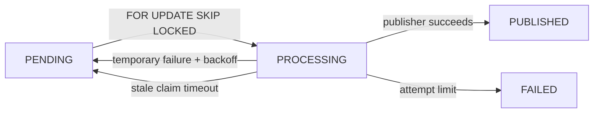

# Ledger and outbox operations

## Configuration

```text
OUTBOX_WORKER_ENABLED=false
OUTBOX_POLL_MS=1000
TEST_DATABASE_URL=postgres://.../giantpay_test
```

Keep the worker disabled until an approved publisher replaces the internal
no-op development publisher. Never point `TEST_DATABASE_URL` at development or
production; integration tests create and drop isolated schemas and truncate
their own tables.

## Worker lifecycle



Outbox publication is at-least-once. Downstream consumers must use the
deduplication key. Stop the process with SIGINT or SIGTERM so polling stops
before the database pool closes.

Investigate `FAILED` records using IDs and normalized errors only. Do not copy
customer payloads, secrets, cookies, or provider credentials into logs.

## Production separation

Payment success, ledger posting, reconciliation, and settlement are distinct.
The sandbox can demonstrate payment and accounting state only. It does not
reconcile provider files, move funds, execute settlements, or prove that money
was received.
## Outbound webhook worker

Set `OUTBOX_WORKER_ENABLED=true` to fan committed outbox events into endpoint
deliveries and process them. Tune `WEBHOOK_DELIVERY_TIMEOUT_MS`,
`WEBHOOK_MAX_RESPONSE_BYTES`, and `WEBHOOK_MAX_ATTEMPTS`. Production requires a
dedicated `WEBHOOK_SECRET_KEY`, HTTPS-only mode, and network egress controls.
Workers claim rows with `FOR UPDATE SKIP LOCKED`; stale five-minute claims are
recoverable. Operators can inspect attempts without secrets or authorization
headers, and authorized merchants can manually requeue terminal failures.

## Health probes

`GET /v1/health/live` proves only that the HTTP process can respond. Kubernetes
or an equivalent supervisor should use `GET /v1/health/ready` for traffic: it
returns success only when PostgreSQL responds and essential configured workers
have started. Neither response contains dependency addresses or configuration.
